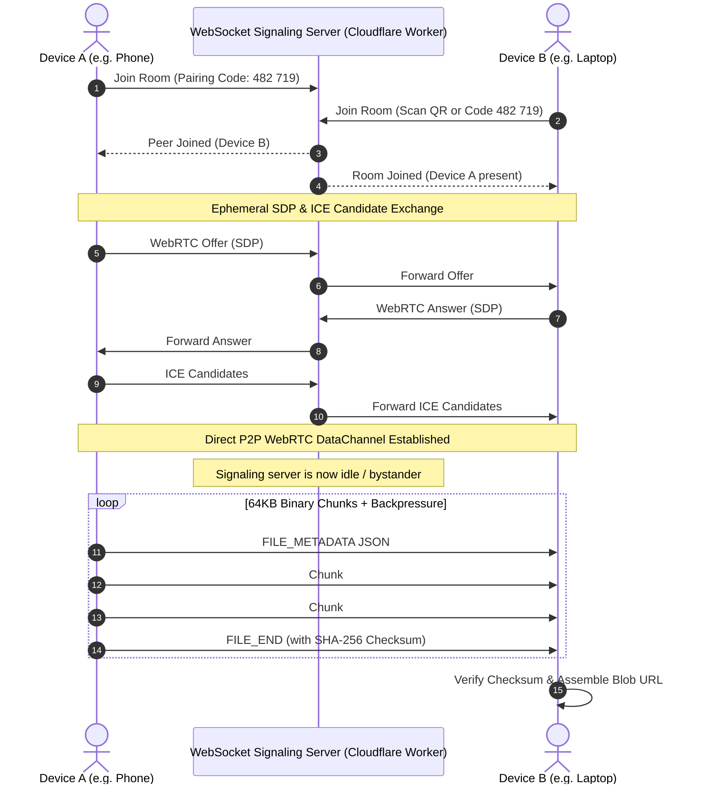

# DropLink ⚡
> **Move files. Not through the cloud.**  
> Ultra-fast, private, peer-to-peer file sharing between mobile phones, laptops, tablets, and desktop computers.

DropLink is an account-free, zero-storage web application for direct file transfers between devices (Phone ↔ Laptop, Phone ↔ Phone, Laptop ↔ Laptop, iPhone ↔ Windows, Android ↔ Mac). It utilizes WebRTC DataChannels with chunked streaming, backpressure control, and lightweight WebSocket signaling.

---

## 🌟 Key Features

- ⚡ **Direct Wire Transfer Speed**: Data streams directly peer-to-peer over local network hardware without round-tripping through cloud servers.
- 🔒 **Zero Cloud Storage**: Files never touch an intermediate server, database, or disk.
- 🔐 **End-to-End Encrypted**: WebRTC DataChannels are encrypted by default with DTLS (Datagram Transport Layer Security) and SRTP.
- 📱 **Cross-Device Everywhere**: Works across iOS Safari, Android Chrome, Windows, macOS, and Linux without native apps or drivers.
- 🚫 **Zero Account Friction**: No passwords, emails, or user accounts.
- 🔗 **QR & 6-Digit Pairing**: Instant pairing via camera QR scan or memorable 6-digit numeric codes.
- 📦 **Memory-Safe Chunking**: Large files are sliced into 64KB binary packets with backpressure management (`bufferedAmountLowThreshold`), preventing tab memory crashes.
- 🗜️ **Client-Side ZIP & Download**: "Download All" packages multiple incoming files directly in browser memory using JSZip.
- 🛡️ **SHA-256 Data Integrity**: Verification via Web Crypto API ensures bit-for-bit file integrity.
- 🌓 **Sophisticated Dark & Light Themes**: Dark charcoal/slate aesthetic with seamless light mode toggle.
- ♿ **Reduced Motion Support**: Fully respects `prefers-reduced-motion` settings.

---

## 🏗️ Architecture



---

## 📁 Project Structure

```
F-share/
├── public/
│   ├── favicon.svg          # Minimalist brand logo
│   ├── icon-192.svg         # PWA icon
│   └── manifest.json        # Web App Manifest
├── server/
│   └── signaling-dev.js     # Standalone Node.js WebSocket signaling server
├── worker/
│   └── index.ts             # Cloudflare Worker Durable Object signaling script
├── src/
│   ├── components/
│   │   ├── DeviceHeroAnimation.tsx  # Animated phone-to-laptop particle visualization
│   │   ├── FileDropZone.tsx         # Drag-and-drop & folder/file picker
│   │   ├── FileList.tsx             # Selected file queue with thumbnails and size totals
│   │   ├── Header.tsx               # Brand header, connection badge, theme switcher
│   │   ├── PairingModal.tsx         # 6-digit code, vector QR code & copy link
│   │   ├── QRScannerModal.tsx       # Mobile camera QR scanner & manual code entry
│   │   ├── SettingsModal.tsx        # Device name, theme, and auto-download options
│   │   ├── SuccessState.tsx         # Transfer summary & client-side ZIP generator
│   │   ├── Toast.tsx                # Non-intrusive event notifications
│   │   └── TransferProgress.tsx     # Real-time transfer speed, ETA & progress bars
│   ├── hooks/
│   │   ├── useDevice.ts             # Hardware and browser detection
│   │   ├── useFileTransfer.ts       # Transfer orchestration & queue state machine
│   │   └── useWebRTC.ts             # WebRTC connection & signaling lifecycle
│   ├── pages/
│   │   ├── LandingPage.tsx          # Hero, features, how-it-works, privacy, FAQ
│   │   └── ShareApp.tsx             # Main interactive transfer workspace
│   ├── services/
│   │   ├── fileTransfer.ts          # 64KB chunking, backpressure & verification
│   │   ├── signaling.ts             # WebSocket client with auto-reconnect
│   │   └── webrtc.ts                # RTCPeerConnection and DataChannel engine
│   ├── types/
│   │   ├── device.ts                # Device and peer types
│   │   ├── signaling.ts             # Signaling message schemas
│   │   └── transfer.ts              # File metadata & transfer items
│   ├── utils/
│   │   ├── chunking.ts              # Packet framing and binary headers
│   │   ├── crypto.ts                # Client-side SHA-256 Web Crypto hashing
│   │   ├── deviceDetection.ts       # Device name and platform parser
│   │   ├── formatting.ts            # Bytes, speeds, ETA and sanitization
│   │   ├── session.ts               # 6-digit code and peer ID generator
│   │   └── __tests__/               # Vitest unit test suites
│   ├── App.tsx                      # Root component with routing and WebRTC check
│   ├── index.css                    # Tailwind CSS v4 design tokens
│   └── main.tsx                     # React entrypoint
├── wrangler.toml                    # Cloudflare Worker configuration
└── vite.config.ts                   # Vite config with integrated dev signaling
```

---

## 🚀 Quick Start (Local Development)

### 1. Install dependencies
```bash
npm install
```

### 2. Run dev server with integrated signaling
```bash
npm run dev
```
> The Vite dev server automatically includes an integrated WebSocket signaling server at `ws://localhost:5173/signaling`! Open [http://localhost:5173](http://localhost:5173) in two browser windows or tabs.

### 3. Run unit tests
```bash
npm test
```

### 4. Build for production
```bash
npm run build
```

---

## 🌐 Deployment Guide

### Frontend Deployment (Cloudflare Pages)
1. Push your repository to GitHub or GitLab.
2. In the [Cloudflare Dashboard](https://dash.cloudflare.com/), go to **Workers & Pages** > **Create application** > **Pages** > **Connect to Git**.
3. Configure build settings:
   - **Framework preset**: `Vite`
   - **Build command**: `npm run build`
   - **Build output directory**: `dist`
4. Add environment variables:
   - `VITE_SIGNALING_URL`: `wss://your-signaling-worker.workers.dev/signaling`

### Signaling Backend Deployment (Cloudflare Worker)
DropLink includes a dedicated, free-tier Cloudflare Worker script (`worker/index.ts`) utilizing Durable Objects / WebSockets:

1. Authenticate with Wrangler:
   ```bash
   npx wrangler login
   ```
2. Deploy the signaling worker:
   ```bash
   npx wrangler deploy
   ```
3. Copy your deployed worker URL (e.g., `https://droplink-signaling.<subdomain>.workers.dev`) and set `VITE_SIGNALING_URL=wss://droplink-signaling.<subdomain>.workers.dev/signaling` in your frontend environment.

---

## ⚙️ Environment Variables

Copy `.env.example` to `.env.local`:

| Variable | Description | Default |
| :--- | :--- | :--- |
| `VITE_SIGNALING_URL` | WebSocket endpoint for signaling | Auto-detected (`/signaling`) in local dev |
| `VITE_STUN_SERVERS` | JSON array of STUN servers for NAT traversal | Google Public STUN (`stun.l.google.com:19302`) |
| `VITE_TURN_SERVERS` | *(Optional)* TURN relay servers for restrictive corporate NATs | None |

---

## 📋 Manual Testing Checklist

| Test Scenario | Steps | Expected Result |
| :--- | :--- | :--- |
| **Phone → Laptop Pairing** | Open on Laptop, click "Send Files" to get QR code. Open on phone camera, scan QR. | Both devices show "Connected with [Peer Name]" within 2s. |
| **Manual 6-Digit Code** | Enter 6-digit code on Device B without camera. | Connects immediately, room is established. |
| **Image & Video Transfer** | Select multi-megabyte JPG/MP4 files and click Send. | Real-time progress bar, smoothed MB/s rate, and accurate ETA. |
| **Download All as ZIP** | Receiver selects 3+ files and clicks "Download All as ZIP". | JSZip bundles all files client-side into a single archive download. |
| **Large File Backpressure** | Send a 100MB+ file. | Buffer stays capped under 1MB threshold; browser UI remains responsive without memory leak. |
| **Transfer Cancellation** | Click "Cancel Transfer" midway through transmission. | Sending and receiving stop cleanly; temporary Blobs are released. |
| **Dark / Light Toggle** | Click theme toggle in header or settings. | Smooth color scheme transition with crisp contrast. |
| **Camera Permission Denial** | Deny camera permission in QR scanner modal. | Shows friendly error notice and offers "Enter Code Instead" tab. |

---

## 🔒 Security & Technical Privacy

- **No Server Payload Storage**: File contents never pass through or get saved on the signaling worker or any server.
- **Sanitized Filenames**: Filenames are strictly sanitized to prevent directory traversal (`../`) or script injection.
- **Strict Content Isolation**: Files are reconstructed as standard Blobs and downloaded via browser safe downloads, never executed in the DOM.
- **Automatic Session Expiration**: Rooms and peer channels are temporary and discarded immediately upon tab closure or disconnection.

---

## 📄 License
MIT License. Built for seamless, private peer-to-peer file transfer.
